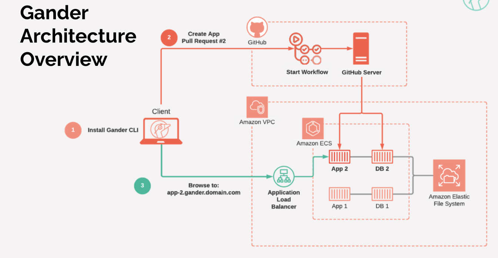

<p align="center">
  
</p>

<h1 align="center">Gander: Open source solution for deploying isolated, ephemeral apps based on your pull requests</h1>
<h2 align="center">All you need is an AWS account and a GitHub repo to get started</h2>

Gander automates the provisioning, state, and teardown of your review apps while allowing you maintain full control over your source code and self-hosted infrastructure. Currently, we only support AWS as a cloud provider and Postgres as a database.

To learn more, please read our extensive [case study](http://gander-framework.github.io).

[](https://oclif.io)
[](https://npmjs.org/package/gander-cli)
[](https://npmjs.org/package/gander-cli)
[](https://github.com/gander-framework/gander-cli/blob/master/package.json)

---

# Table of Contents

<!-- toc -->
* [Table of Contents](#table-of-contents)
* [Prerequisites](#prerequisites)
* [Installation and Setup](#installation-and-setup)
* [Commands](#commands)
<!-- tocstop -->

# Prerequisites

<!--prerequisites-->

- AWS Account
- AWS CLI Configured with your AWS Account
- Node + NPM
- Application Repository

### Can my application use Gander?

Your application is supported by Gander if it:

- Uses Postgres for storage
- Can be built into an image using [Cloud Native Buildpacks](https://buildpacks.io/)
<!--prerequisitesstop-->

# Installation and Setup

<p align="center">
  
</p>
<!--installsetup-->

- To get started, run the command `npm install -g gander-cli` to globally install Gander on your machine

- Before initializing Gander with any applications, you must run [`gander setup`](#gander-setup), which will provision and configure all of the necessary infrastructure you need to begin deploying review apps. See [Commands](#commands) for more information about this command. Keep track of the AWS access keys that are generated during this process - this is the only place they will ever appear.
- Add a wildcard CNAME DNS Record to the domain you provided
```sh-session
$ npm install -g gander-cli
$ gander setup
running setup...
$ gander (-v|--version|version)
gander-cli/0.0.1 darwin-x64 node-v14.15.1
$ gander --help [COMMAND]
...
```

### To integrate Gander with an application:

- Navigate to the root of your project repository
- Ensure you are on your application's `main` branch - Gander requires that the generated Github workflow files be present on this branch for the review app process.
- Run `gander init` - See [Commands](#commands) for details about each piece of information `init` requires.
- Add the AWS Access Keys that were generated during `gander setup` as [secrets](#https://docs.github.com/en/actions/reference/encrypted-secrets) to your project's Github repository.
- For Python applications, provide the entrypoint command in a `Procfile` in the root directory using the format `web: $ENTRYPOINT`. The app needs to run on port `8080` with `0.0.0.0` as the host. See the `Procfile` in our sample Django app for an example.
- Django applications can include `'*'` as one of their `ALLOWED_HOSTS` because Gander's load balancer handles host header validation.

### Environment Variables
Gander uses environment variables to manage the connection to the database. 
Your application needs to use these three environment variables:
- `PG_HOST` -- This is the host name for your database connection.
- `PG_USER` -- This is the username for postgres database.
- `PG_PW` -- This is the password for the postgres database.

Gander also needs to be able to set the port your application server listens on using the environment variable `PORT`.

To add additional environment variables to your application server's runtime, follow these steps:
1. Add your environment variables to your repository's [secrets](#https://docs.github.com/en/actions/reference/encrypted-secrets). 
2. Open `.github/actions/build-server/action.yml` 
3. Add your environment variables to the `pack build` command, on lines 22-23.

For example, if you have an API_TOKEN environment variable, it would be added like this after you create your secrets:
```sh
  pack build $IMAGE_ARN \
  --builder $BUILDER \
  --path $SERVER_PATH \
  --env API_TOKEN=${{ secrets.API_TOKEN }} \
  --publish
```
If you have both an API_TOKEN and an API_URL, you can add two environment variables like this:
```sh
  pack build $IMAGE_ARN \
  --builder $BUILDER \
  --path $SERVER_PATH \
  --env API_TOKEN=${{ secrets.API_TOKEN }} \
  --env API_URL=${{ secrets.API_URL }} \
  --publish
```

<!--installsetupstop-->

# Commands

<!-- commands -->
* [`gander destroy`](#gander-destroy)
* [`gander help [COMMAND]`](#gander-help-command)
* [`gander init`](#gander-init)
* [`gander list`](#gander-list)
* [`gander setup`](#gander-setup)
* [`gander where`](#gander-where)

## `gander destroy`

Destroy all AWS resources created for Gander review apps

```
USAGE
  $ gander destroy
```

_See code: [src/commands/destroy.js](https://github.com/Gander-Framework/gander-cli/blob/v0.0.0/src/commands/destroy.js)_

## `gander help [COMMAND]`

display help for gander

```
USAGE
  $ gander help [COMMAND]

ARGUMENTS
  COMMAND  command to show help for

OPTIONS
  --all  see all commands in CLI
```

_See code: [@oclif/plugin-help](https://github.com/oclif/plugin-help/blob/v3.2.2/src/commands/help.ts)_

## `gander init`

Initialize your project repository as a Gander review app

```
USAGE
  $ gander init
```

_See code: [src/commands/init.js](https://github.com/Gander-Framework/gander-cli/blob/v0.0.0/src/commands/init.js)_

## `gander list`

List all active Gander repos

```
USAGE
  $ gander list
```

_See code: [src/commands/list.js](https://github.com/Gander-Framework/gander-cli/blob/v0.0.0/src/commands/list.js)_

## `gander setup`

Create all the AWS resources required to deploy Gander review apps

```
USAGE
  $ gander setup
```

_See code: [src/commands/setup.js](https://github.com/Gander-Framework/gander-cli/blob/v0.0.0/src/commands/setup.js)_

## `gander where`

Print out the location of your Gander global configuration file

```
USAGE
  $ gander where
```

_See code: [src/commands/where.js](https://github.com/Gander-Framework/gander-cli/blob/v0.0.0/src/commands/where.js)_
<!-- commandsstop -->
